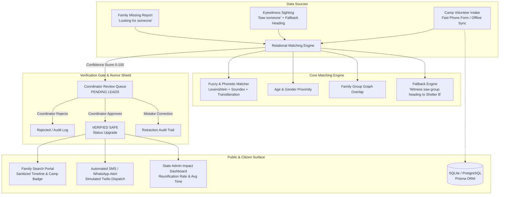

# GlobalX (குளோபல் எக்ஸ் / ग्लोबल एक्स)
> **Disaster-Affected Family Reunification & Verified Shelter Intelligence Platform**  
> *"We don't just find people, we stop false rumors."*

[](file:///c:/Users/Anivesh/OneDrive/Desktop/compiler1/server/tests)
[](http://localhost:5173)
[](#)

---

## 🌪️ The Problem
During chaotic flood, cyclone, or landslide evacuations (e.g. Cyclone Michaung in Tamil Nadu or Wayanad landslides in Kerala):
- Families get separated during rescue boat/tractor operations.
- The missing cannot register themselves; survivors are scattered across dozens of relief shelters.
- Unverified rumors and social media forwards create panic and false hope.
- Field volunteers frequently face poor or zero internet signal.

## 🛡️ The GlobalX Solution
GlobalX links three distinct real-time data sources:
1. **Direct missing-person reports** filed by searching families.
2. **Eyewitness sightings** reported by citizens and volunteers on the ground.
3. **Official shelter rosters** recorded by relief camp volunteers.

A high-performance **Relational Matching Engine** bridges them using South Asian transliteration normalization, Soundex phonetic matching, age proximity, and group graph relationships.  
Crucially, **Camp Coordinators verify all algorithmic leads before they are shown publicly**—acting as an impenetrable **Rumor Shield**.

---

## 🚀 Setup in Under 5 Commands

```bash
# 1. Install root dependencies
npm install

# 2. Install server and client packages
npm run install:all

# 3. Seed realistic demo data (2 disasters, 4 camps, 40+ people, fallback leads)
npm run seed

# 4. Run the automated test suite (Fuzzy matcher, Fallback logic, API tests)
npm run test:server

# 5. Launch both Server & Client with 1 command!
npm run dev
```

- **Frontend App:** [http://localhost:5173](http://localhost:5173)
- **Backend REST API:** [http://localhost:5000/api](http://localhost:5000/api)
- **Health Check:** [http://localhost:5000/api/health](http://localhost:5000/api/health)

---

## 🏛️ System Architecture



---

## ⏱️ 3-Minute Hackathon Demo Script

| Time | Stage | Action / Persona | What the Evaluator Sees |
|---|---|---|---|
| **0:00 - 0:35** | **The Family Intake** | Start as **Public / Family** persona on [http://localhost:5173](http://localhost:5173). Click **"I'm looking for someone"**. Use **Voice Input** or type: `Murugan Selvam`, Age `42`, Velachery Bus Stand. | Form submits instantly; generates Report ID `MIS-7011` and a **Family QR Token**. Mentions SMS confirmation sent. |
| **0:35 - 1:10** | **Field Volunteer Intake** | Switch top persona banner to **"Camp Volunteer"**. Go to **Camp Intake** (`/volunteer-intake`). | Show large mobile touch buttons. Mention **Offline-First PWA Mode** (intakes queue locally if signal drops, with 1-click batch sync). Volunteer logs survivor `Murugesh Selvam`, Age `43`, at *Loyola College Relief Shelter*. |
| **1:10 - 1:55** | **Engine & Coordinator Verification** | Switch persona to **"Camp Coordinator"**. Open **Coordinator Queue** (`/coordinator`). | **The WOW Moment:** Engine matches `Murugan` ~ `Murugesh` (88% confidence) despite spelling variation. Shows plain-language reasoning: *"Fuzzy name similarity; phonetic match M625; matching age within 2 yrs"*. Point to the **Rumor Shield**: unverified leads are kept confidential until the coordinator taps **"Verify & Confirm Safe"**. |
| **1:55 - 2:30** | **Family Portal & Rumor Shield** | Switch persona back to **"Family / Public"**. Open **Search Portal** (`/search?q=Murugan`). | Family sees official **"VERIFIED SAFE AT LOYOLA COLLEGE SHELTER"** green badge with exact verified timestamp and timeline. Show that phone numbers are privacy-masked. |
| **2:30 - 3:00** | **Standout Unique Features** | Demo **Fallback Lead** (`Meenakshi` heading to Shelter B), tap **SMS Helpline** simulator modal to query `MIS-7044`, view **Live Camps Map** with relief supplies needed, and open **Admin Dashboard** (`/dashboard`) showing average reunion speed (**4.2 hours**). |

---

## 🌟 Key Standout Features

### 1. Dual-Mode Intake Hero (48px+ Touch Targets)
- **"I'm looking for someone":** Family missing person inquiry with priority tagging.
- **"I saw someone":** Sighting form with multi-person separated prompt: *"Did you see anyone else who was separated?"*

### 2. Relational Matching Engine with Fallback Logic
- **South Asian Transliteration Normalization:** Handles phonetic equivalences (`Murugan` vs `Murugesh`, `Priyah` vs `Priya`, `Laxmi` vs `Lakshmi`).
- **Weighted Multi-Factor Scoring:** Name (35%), Age proximity (15%), Gender (15%), Location (15%), Family Group overlap (15%), Physical features (5%).
- **Fallback Logic:** If no camp entry exists yet, eyewitness sightings reporting a destination (e.g. *"evacuation bus heading towards St. Thomas Community Hall Relief Camp"*) create proactive fallback leads for family peace of mind.
- **Priority Escalation:** Unaccompanied minors (`CHILD_ALONE`), elderly (`ELDERLY`), and critical medical needs (`CRITICAL_MEDICAL`) are pinned to the top of the queue.

### 3. Rumor Control Shield & Coordinator Audit Trail
- Unverified leads display only: *"We have a possible lead under coordinator verification"*—preventing false hope and viral rumors.
- Coordinators can approve, reject, or **retract** leads with an immutable audit log.

### 4. Offline-First PWA for Field Volunteers
- Field responders can log intake in flooded basements without internet connectivity. Records are saved locally in storage and synchronized via `/api/intake/batch-sync` once signal returns.

### 5. Multilingual Interface (English, தமிழ், हिन्दी)
- Instant language switcher in the navbar with accessible icons so low-literacy users can operate under extreme stress.

### 6. Voice Input (Web Speech API)
- Stressed citizens or responders can tap the microphone button on any text field to speak directly.

### 7. Interactive SMS / WhatsApp Helpline Simulator
- Texting simulation modal mimicking a 2G shortcode or WhatsApp bot: reply with your Report ID to receive instant automated status without requiring internet data.

### 8. Live Camps & Supply Needs Map (Leaflet)
- Interactive OpenStreetMap with color-coded camp occupancy bars and urgent relief supply tags (*Baby food, Clean drinking water, Insulin, Blankets*).

### 9. Admin Impact Dashboard & Disaster Mode Switcher
- Tracks total reported, located, verified reunions, and **average reunification time**. State coordinators can switch between disasters (e.g. *Cyclone Michaung Flood* vs *Wayanad Landslides*).

---

## 🔒 Privacy, Child Safety & Ethics
- **Zero Public Exposure of Children:** Photos and identifiable records of unaccompanied minors are restricted to verified camp staff.
- **Strict Masking:** Public search results mask phone numbers (`+91 98****89`) and residential addresses.
- **Explicit Consent:** Every intake form includes an emergency data coordination consent checkbox.
- **Data Retention Policy:** Operational shelter records are retained solely for active disaster relief and archived with state encryption afterwards.

---

## 🧪 Test Suite
Run the test suite with:
```bash
cd server
npm test
```
- **8 tests** covering fuzzy matching, South Asian transliteration, phonetic Soundex, and fallback heading logic.
- **5 tests** verifying core API endpoints, privacy masking, QR token lookup, and simulated SMS responses.
